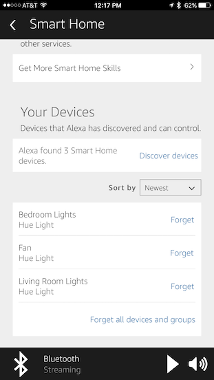

# Alexa Home Interface

[](http://www.youtube.com/watch?v=K0vrEaQr9pU "Video Title")

This is an application of the  [Amazon Echo Bridge](https://github.com/armzilla/amazon-echo-ha-bridge) using:
- [Fernando Silva's Web Interface Orvibo S20 socket](https://github.com/fernadosilva/orvfms)

## Requirements:
- A device installed with JAVA 8, a web server (Apache, NGINX ...), PHP 5.6. 'GIT' to download repositories.
- [Orvibo Wi-Fi Smart Socket Outlet US Plug, Turn ON/OFF Electronics from Anywhere, White (WiWo-S20)](https://www.amazon.com/gp/product/B00KT50HK4/ref=as_li_tl?ie=UTF8&camp=1789&creative=9325&creativeASIN=B00KT50HK4&linkCode=as2&tag=jojokahanding-20&linkId=1b61481d7c5e8d4a40b80c1643c6a831)
- [Echo Dot (2nd Generation) - Black](
https://www.amazon.com/gp/product/B01DFKC2SO/ref=as_li_tl?ie=UTF8&camp=1789&creative=9325&creativeASIN=B01DFKC2SO&linkCode=as2&tag=jojokahanding-20&linkId=c55967b18b25d2c5b92df4d881f469b6)

*Note, I used a [DS716Plus](https://www.amazon.com/gp/product/B016UTXLYQ/ref=as_li_tl?ie=UTF8&camp=1789&creative=9325&creativeASIN=B016UTXLYQ&linkCode=as2&tag=jojokahanding-20&linkId=fd23f4a2cf2ee06d42961657f7f0ba0d) as my device *

## Installation:
- GOTO your webserver path. *For example sake, lets assume http://localhost/ is mapped to /var/htdocs *
- do a git clone of this repository
- bash commands
```bash
cd alexa.home
chmod 777 install.sh
./install.sh
# For first time install you have to do the following
copy backend/custom-config.php backend/config.php
copy amazon-echo.java/custom-listen.sh amazon-echo.java/listen.sh
chmod 777 amazon-echo.java/listen.sh
```
- on a first time install please modify the following files:
```php
define('PATH_LOGFILE', "/volume1/homes/jojo/temp/");
define('EOL_LOG', "\r\n");
```
backend/config.php change **PATH_LOGFILE**,
```bash
#!/bin/sh
MYDATAPATH=/volume1/homes/jojo/www/alexa.home/amazon-echo.java
MYJAVAPATH=/var/packages/Java8/target/j2sdk-image/bin/java
MYAMAZONBRIDGEPATH=/volume1/homes/jojo/www/alexa.home/amazon-echo.java/amazon-echo-bridge-0.4.0.jar
MYIPADDRESS=192.168.1.14
MYLOGFILE=/volume1/homes/jojo/temp/amazon_bridge.log
cd $MYDATAPATH
nohup $MYJAVAPATH -jar $MYAMAZONBRIDGEPATH --upnp.config.address=$MYIPADDRESS > $MYLOGFILE &
```
amazon-echo.java/listen.sh change
**MYDATAPATH**, **MYJAVAPATH**, **MYAMAZONBRIDGEPATH**, **MYIPADDRESS**, **MYLOGFILE**
- AFter the modifications you can now start listen.sh
```bash
cd amazon-echo.java
./listen.sh
```
## Configuring your Orvibo Smart socket:
Configuration of the sockets can be done using the [iPhone Wiwo App](https://itunes.apple.com/us/app/wiwo/id859140969?mt=8)
 Once you have your device configured

Take note of the Device list.

### Testing the Url interface
*Assuming we have our interface installed an ip address 192.168.1.14/alexa.home and one of our devices is named 'Fan'. Issue the following commands from your browser:*
Turning the Fan On
```url
http://192.168.1.14/alexa.home/backend/serverS20.php?CMD=ON&NAME=Fan
```
Turning the Fan Off
```url
http://192.168.1.14/alexa.home/backend/serverS20.php?CMD=OFF&NAME=Fan
```

### Attaching your Devices to the Amazon Echo Bridge:
From your browser proceed to http://192.168.1.14:8081/configurator.html#
Add your Devices and their On and Off URL Interfaces


## Configuring  Alexa  
- Using your Alexa Phone App proceed to "Smart Home".

- Hit Discover Devices

- Devices will appear

You can now turn these devices on or off by saying "Alexa Turn on {DeviceName}".
